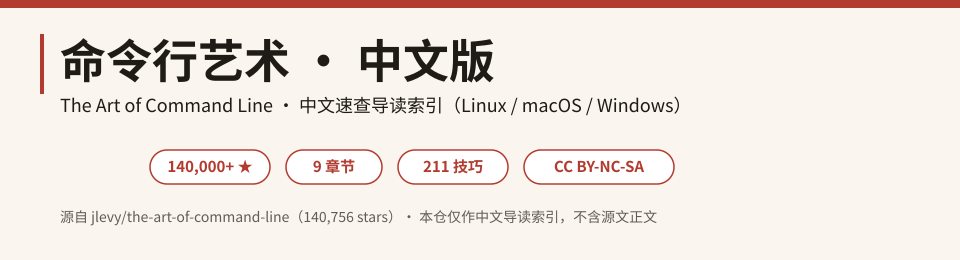
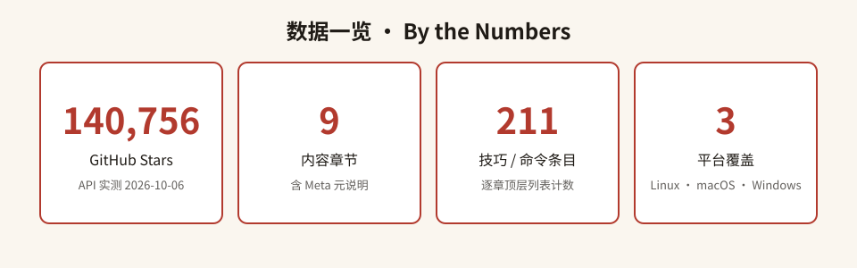

  

<h1 align="center">命令行艺术 · 中文版</h1>

<b>The Art of Command Line · 中文速查导读</b> 
源自全球 <b>140,000+ ★</b> 的极客圣经 · 精选 <b>211</b> 条命令行技巧 · 覆盖 Linux / macOS / Windows

  
  
  
  

---

## 目录

- [这是什么](#这是什么)
- [为什么值得收藏](#为什么值得收藏)
- [数据一览](#数据一览)
- [快速开始](#快速开始)
- [分类清单（按章节）](#分类清单按章节)
- [高频命令速查表](#高频命令速查表)
- [全量索引](#全量索引)
- [FAQ](#faq)
- [参与贡献](#参与贡献)
- [致谢](#致谢)
- [许可声明](#许可声明)

---

## 这是什么

这是知名开源项目 **[jlevy/the-art-of-command-line](https://github.com/jlevy/the-art-of-command-line)** 的**中文速查导读版**。

原作是一页长的「极客圣经」：它不教你写复杂脚本，而是把工程师在 Linux / macOS / Windows 命令行上**真正每天用得到**的技巧、快捷键、冷门命令浓缩在一页里——从 Tab 补全、`Ctrl-R` 历史搜索，到 `awk` 一行求和、`rsync` 断点续传、`strace` 排障。

> 「This page is not long, but if you can use and recall all the items here, you know a lot.」
> —— 原文如是说。

本仓不复制源文正文，只做**中文导读索引**：把 9 大章节、211 条技巧翻译归类成一张可扫读的地图，帮你 30 秒定位到想要的那一条，再跳回原文深读。

## 为什么值得收藏

- **经过百万级工程师验证**：源仓 14 万+ star，是命令行领域被引用最多的单页指南。
- **一页密度极高**：没有废话，每条都是「在某个场景下必不可少 / 显著省时」。
- **从入门到高手全覆盖**：既讲 `ls -l` 每一列含义，也讲 `/proc`、SystemTap、JVM 调优。
- **跨平台**：主体面向 Linux，另设 macOS（brew/pbcopy）与 Windows（WSL/Cygwin）专章。
- **中文索引零门槛**：不用对着英文目录猜「Obscure but useful」到底是啥，直接看中文章名找。

## 数据一览

  

- **140,756** GitHub Stars（2026-10-06 API 实测）
- **9** 个内容章节（含 Meta 元说明）
- **211** 条技巧 / 命令（逐章顶层列表人工计数）
- **3** 大平台：Linux · macOS · Windows

## 快速开始

  

1. **翻章节**：在下面的[分类清单](#分类清单按章节)里按中文主题定位；
2. **查速查表**：急着用就直接看[高频命令速查表](#高频命令速查表)；
3. **上手练**：打开真实终端（Linux 原生 / macOS Terminal / Windows WSL）敲一遍。

---

## 分类清单（按章节）

| # | 章节中文名 | 英文原名 | 条目数 | 代表技巧 |
|---|-----------|----------|:-----:|----------|
| 1 | 元说明 | Meta | 6* | 适用范围广度/具体性/简洁性；用 explainshell 拆解命令 |
| 2 | 基础 | Basics | 12 | `man bash` 通读；精通 `vi`/`nano`；`grep -i -v -C` 正则 |
| 3 | 日常使用 | Everyday use | 44 | `Ctrl-R` 搜历史；`xargs`；`set -euo pipefail`；`tmux`；`fzf` |
| 4 | 文件与数据处理 | Processing files and data | 35 | `jq` 处理 JSON；`rg` 搜索；`awk`/`sed`；`rsync` 同步 |
| 5 | 系统调试 | System debugging | 20 | `htop`/`iostat`；`strace`；`/proc`；`ncdu` 找大文件 |
| 6 | 一行流 | One-liners | 8 | `sort/uniq` 集合运算；`awk` 列求和；`watch` 监控 |
| 7 | 冷门但有用 | Obscure but useful | 72 | `nc`/`socat`；`tree`；`ss`；`units`；`when-changed` |
| 8 | 仅 macOS | macOS only | 7 | `brew`；`pbcopy`/`pbpaste`；`open`；`mdfind` |
| 9 | 仅 Windows | Windows only | 13 | WSL；Cygwin；`wmic`；`cygpath` |

\* Meta 为说明性内容，不计入 211 技巧总数。完整逐章条目清单见 [cheatsheet-index.md](cheatsheet-index.md)。

---

## 高频命令速查表

> 从 211 条中精选 22 条最常用的，全部来自源 README 真实内容。

| 命令 / 快捷键 | 中文说明 |
|--------------|----------|
| `man <cmd>` / `man man` | 查命令手册；`man man` 看章节号；`apropos` 模糊找手册 |
| `Ctrl-R` | 反向搜索命令历史，连按循环匹配，回车执行 |
| `Tab` | 自动补全命令/路径，连按两次列出所有候选 |
| `cd -` / `~` | 回到上一目录 / 回到家目录 |
| `ls -l` / `ls -lh` | 长格式列文件，搞懂每一列含义 |
| `tail -f` / `less +F` | 实时跟踪日志新增内容 |
| `grep` / `rg` | 搜索内容；`-i -v -A -B -C`，大代码库用更快的 `rg` |
| `find . -iname` / `locate` | 按名找文件；`locate` 走索引更快 |
| `xargs` | 把前一个命令的输出当参数批量执行（`-I{}` `-P`） |
| `awk '{x+=$3} END{print x}'` | 一行求和/列处理的瑞士军刀 |
| `sed 's/old/new/g'` | 流编辑器，批量替换 |
| `sort` / `uniq -c` | 排序去重计数；配合 `comm` 做集合运算 |
| `curl -I` / `httpie` | 调试 HTTP 请求，看响应头 |
| `ssh` / `ssh-agent` | 远程登录；免密与端口隧道 `-L` |
| `tmux` / `screen` | 终端复用，断线重连会话不丢 |
| `htop` / `top` | 看进程与 CPU/内存占用 |
| `du -hs *` / `ncdu` | 查磁盘占用，`ncdu` 交互式更直观 |
| `strace -p <pid>` | 跟踪系统调用，排查程序为何卡住/崩溃 |
| `jq` | 命令行解析/过滤 JSON |
| `rsync -av` | 增量同步文件，可断点续传 |
| `watch -n 2 '<cmd>'` | 每隔 N 秒重复执行并高亮变化 |
| `chmod` / `chown` | 改权限/属主；`stat -c '%a'` 看八进制权限 |

---

## 全量索引

9 个章节、211 条技巧的**逐条中文清单**（每条含中文译名与英文原名）已整理在：

👉 **[cheatsheet-index.md](cheatsheet-index.md)**

适合当字典用：记得主题、想不起来命令，去那里翻；想系统过一遍，按章节顺序读。

## FAQ

**Q：这是原书的完整中文翻译吗？**
A：不是。本仓是**导读索引**，不含源文正文。我们只翻译章节结构、命令名与中文说明，示例与完整论述请回[源仓库](https://github.com/jlevy/the-art-of-command-line)阅读原文。

**Q：我是纯新手，能直接看吗？**
A：能。Basics 章就是为你写的——先把 `man`、`ls -l`、重定向、管道、`git` 这几条练熟。

**Q：Windows 用户怎么开始？**
A：装 [WSL](https://learn.microsoft.com/windows/wsl/) 获得完整 Bash 环境；或用 Cygwin。详见原文 "Windows only" 章。

**Q：数字（140,756 / 9 / 211）是哪来的？**
A：星数来自 GitHub API `stargazers_count`；章节与条目数由人工逐条统计源 README，统计口径与过程数字见 [THIRD_PARTY_NOTICES.md](THIRD_PARTY_NOTICES.md)，核实日期 2026-10-06。

## 参与贡献

本仓是中文索引，欢迎：
- 校对/补充中文译名与说明；
- 修正统计口径或错别字；
- 提交更接地气的中文注释。

请直接提 Issue 或 PR。**源文本身的内容改进请到原项目 [jlevy/the-art-of-command-line](https://github.com/jlevy/the-art-of-command-line) 贡献**。

## 致谢

由衷感谢 **Joshua Levy（[@jlevy](https://github.com/jlevy)）** 与 `the-art-of-command-line` 的全体贡献者、译者——这份单页指南已成为全球开发者的命令行启蒙经典。

## 许可声明

- **本仓库（中文导读索引）**：以 **[Creative Commons Attribution-NonCommercial-ShareAlike 4.0（CC BY-NC-SA 4.0）](LICENSE)** 发布。
- **源项目**：`jlevy/the-art-of-command-line` 仓库根目录**无独立 LICENSE 文件**；其 README 尾部 `## License` 章节自我声明为 **Creative Commons Attribution-ShareAlike 4.0（CC BY-SA 4.0，链接 by-sa/4.0）**。
- 如实说明：源 README 实测声明的是 **CC BY-SA 4.0（不含 NonCommercial）**，与本仓采用的 CC BY-NC-SA 4.0 要素不同；因本仓仅为索引、不含源文正文，差异由本仓维护者承担。引用源文时请以源项目 README 尾部声明为准。详见 [THIRD_PARTY_NOTICES.md](THIRD_PARTY_NOTICES.md)。
